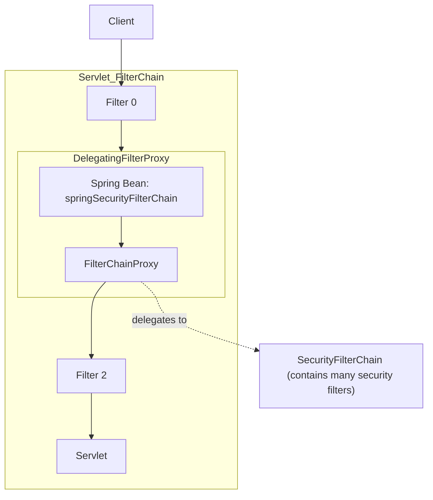
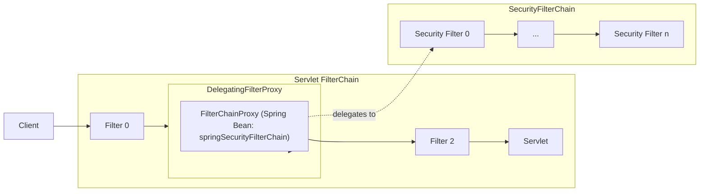

# Filters , Delegation Filter and Security Filter Chain


## Intro
- Spring Security’s Servlet support is based on Servlet Filters,
A `Filter` is an object that performs filtering tasks on either the request to a resource (a servlet or for example) or on the response from a resource, or both


* A Filter can do:
    - Prevent downstream(next) Filter instances or the Servlet from being invoked. In this case, the Filter typically writes the `HttpServletResponse`.

    - Modify the `HttpServletRequest` or `HttpServletResponse` used by the downstream(next) Filter instances and the Servlet.

* the order in which each `Filter` is invoked is extremely important.


* Filters perform filtering in the `doFilter` method, which is called by the `container` each time a request/response pair is passed through the chain.


## Delegration Filter Proxy
- Spring provides a Filter implementation named `DelegatingFilterProxy`, which allows you to identify your own custom filter **as a bean**, this enabled us to create filters that have the awareness of **Spring Application Context Beans,@Autowired,...etc**,
Hence it makes like a bridge between `Servlet Containers` and `Application Context (which is responsible for registering beans)`.

- You can register DelegatingFilterProxy through `the standard Servlet container mechanisms` but **delegate all the work to a Spring Bean that implements `Filter`**.

- `DelegatingFilterProxy` looks up **Bean Filter0** from the `ApplicationContext` and then invokes **Bean Filter0** This excactly what happens:-
1. Servlet Container Starts first.
2. Container must initiate all fo the filters so it initiates `DelegationFilterProxy` filter
3. ContextLoaderListener starts and the application context starts initialize the beans 
4. then within each Http request the `DelegatingFilterProxy` looks up **Bean Filter0** from the `ApplicationContext` and then invokes **Bean Filter0**.


- The following listing shows pseudo code of `DelegatingFilterProxy`

```java
public void doFilter(ServletRequest request, ServletResponse response, FilterChain chain) {
	Filter delegate = getFilterBean(someBeanName); 
	delegate.doFilter(request, response); 
}
```


- **Summary:** the benefit of `DelegatingFilterProxy` is that it allows delaying looking up `Filter bean` instances. This is important because the **container needs to register the Filter instances** before the container can start up. However, Spring typically uses a `ContextLoaderListener` to load the Spring Beans, which is not done until after the `Filter` instances need to be registered.


## FilterChainProxy
**FilterChainProxy** :is a special Filter provided by Spring Security that allows delegating to many `Filter` instances through `SecurityFilterChain`. 

> Since **FilterChainProxy** is a Bean, it is typically wrapped in a DelegatingFilterProxy




## SecurityFilterChain
- A `SecurityFilterChain` is a list of `Filter` instances that are applied to an incoming request. `FilterChainProxy` uses `SecurityFilterChain` to determine which Spring Security Filter instances should be invoked for the current request.




